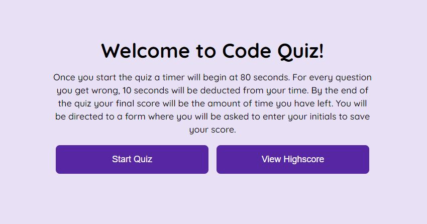

# Code Quiz
## Description

In this project a quiz was created using javascript, html, and css. When you start the quiz a timer will begin and present a question. When the question is answered, then it will continue on to the next question. If a question is answered incorrectly time will be subtracted from the clock. When all the questions are answered or when the timer reaches 0, the quiz is over. You will be directed to a form and will be asked to save your initials and score.

